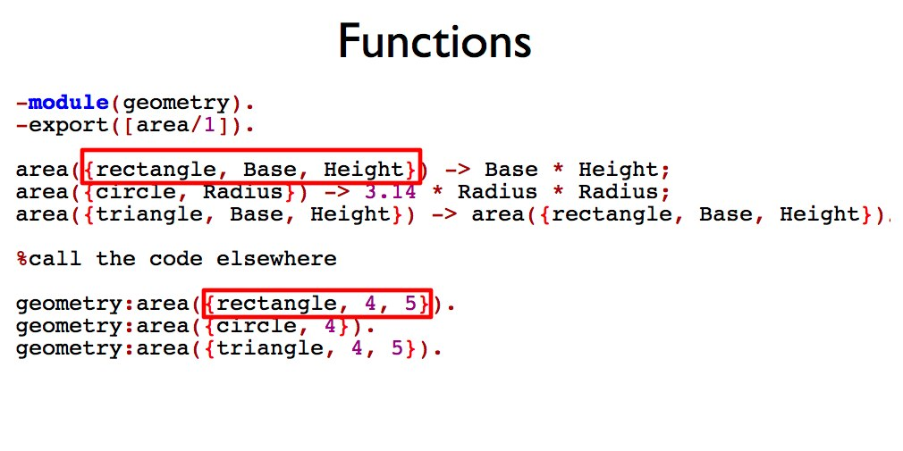
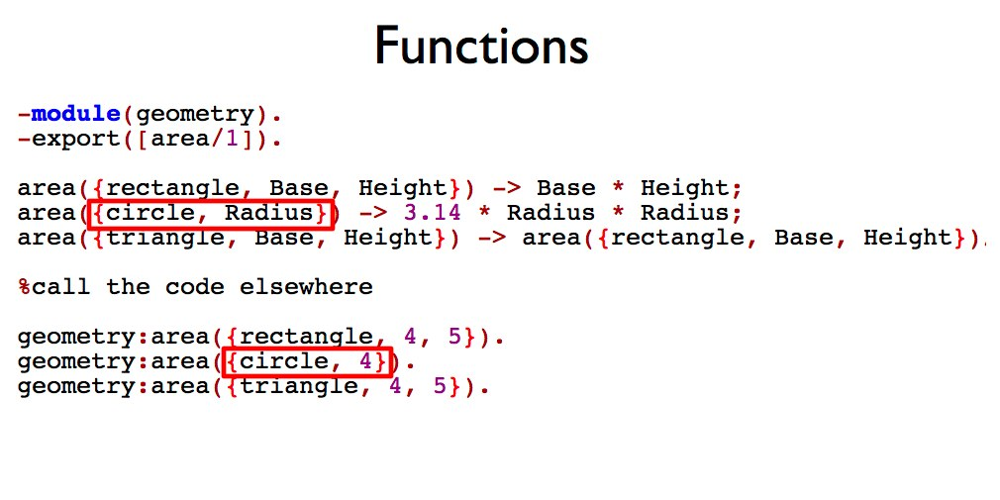
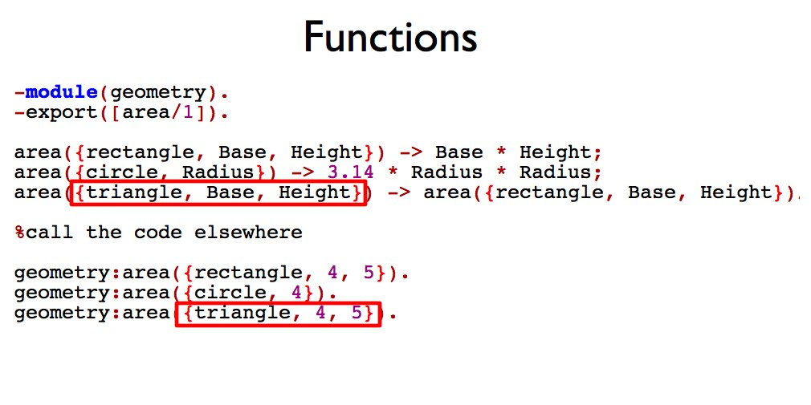

!SLIDE incremental bullets

# Learning Erlang through Ruby

* Look at Ruby code and then try to compare to a similar piece of code in Erlang. 
* Not all code can be a perfect match or fit. 
* This will allow you to use existing knowledge to better learn Erlang.

!SLIDE incremental commandline

#Shell

  
  

	$ erl

	Eshell V5.8  (abort with ^G)
	1> 1 + 1.
	2

!SLIDE bullets

#Variables

	@@@ ruby
	X = 10. 
	Y = "john".
	Z = 3.14.

!SLIDE bullets incremental

#Pattern matching

* = looks like an assignment operator but 
* it is really a pattern matching operator
* X is unbound
* X = 10 is bound
* can only bind a variable once

!SLIDE

#Pattern matching

	@@@ ruby
	X.
	variable X is unbound

	X = 2 + 4.
	X = 6.
	X = 3 + 3.
	X = 6 + 0.
	X = 5 + 1.
	X = 6 * 1.

!SLIDE

#Erlang

##Non numeric constant value 
##Start with lower case letter  

	@@@ ruby
	Temp = hot.
	Age = old.
	

!SLIDE

#Tuple

##Convention is to use a meaningful atom that represents the data that follows  

	@@@ ruby
	Person = {person, {name, "john"}, {age, 99}}.

!SLIDE

#More Pattern Matching

	@@@ruby
	%extracting values out of a tuple

	Point = {point, 10, 45}.
	{point, X, Y} = Point.
	
	%10 is bound to X
	%45 is bound to Y
	%point, well is just a point
	

	
!SLIDE

#List

	@@@ ruby
	Numbers = [1, 2, 3].
	Information = ["john", 99, blue].
	ShoppingList = [{bananas, 10}, {milk, 2}].

!SLIDE bullets incremental

#Getting values out of a list

* **head** is the first item in the list
* **tail** is the rest of the list

!SLIDE bullets incremental

#Getting values out of a list

	@@@ruby
	Nums = [1,2,3,4,5]
	[Head|Tail] = Nums.
	% Head has the value of 1
	% Tail has the rest	[2,3,4,5]

	[Head2|Tail2] = Tail.
	% Head2 has the value of 2
	% Tail2 has the rest [3,4,5]

	

!SLIDE smaller

#Functions

	@@@ruby
	-module(geometry).
	-export([area/1]).

	area({rectangle, Base, Height}) -> Base * Height;
	area({circle, Radius}) -> 3.14 * Radius * Radius;
	area({triangle, Base, Height}) -> area({rectangle, Base, Height})/2.

	%call the code elsewhere

	geometry:area({rectangle, 4, 5}).
	geometry:area({circle, 4}).
	geometry:area({triangle, 4, 5}).

!SLIDE incremental bullets

#Calling the correct clause

* no conditionals
* pattern match arguments

!SLIDE center

!SLIDE center

!SLIDE center

!SLIDE smaller

#Anonymous functions

  

	@@@ruby
	Triple = fun(X) -> 3 * X end.
	Triple(10).
	
	UpIt = fun({double, Num}) -> 2 * Num; 
		    ({triple, Num}) -> 3 * Num 
			end.
	Upit({double, 10}).
	UpIt({triple, 10}).

	%more pattern matching

!SLIDE smaller

#Map and List Comprehension

  

	@@@ruby
	Numbers = [1,2,3,4,5].

	%Built-in Function (BIF)
	lists:map(fun(Number) -> Number * 2 end, Numbers).

	%Use list comprehension
	[2 * Number || Number <- Numbers].
